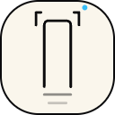

<div align="center">



# Screencappy

**One click, one full page screenshot. Capture, annotate, export.**
<br>
Free, open source, and private by design.

[](https://github.com/aaronepinto/smollet-screencappy/actions/workflows/ci.yml)
[](https://github.com/aaronepinto/smollet-screencappy/releases/latest)
[](LICENSE)

[Website](https://screencappy.smollet.app) &nbsp;·&nbsp;
[Download](https://github.com/aaronepinto/smollet-screencappy/releases/latest) &nbsp;·&nbsp;
[FAQ](https://screencappy.smollet.app/faq) &nbsp;·&nbsp;
[Privacy](https://screencappy.smollet.app/privacy) &nbsp;·&nbsp;
[Report a bug](https://github.com/aaronepinto/smollet-screencappy/issues/new/choose)

</div>

Screencappy is a free, Apache-2.0 licensed Chrome extension that captures full page screenshots in one click, annotates them, and exports them as PNG, JPEG, WebP or PDF. Everything that sits behind a paywall elsewhere, annotation, blur and redaction, emoji stamps, PDF export, is free here. Nothing ever leaves your machine: no account, no cloud, no analytics, and no host permissions, so the extension cannot read a page until you ask it to.

## 📦 Install

Store listings are not live yet, so the release build is the distribution channel today.

**From a release:**

1. Download `screencappy.zip` from the [latest release](https://github.com/aaronepinto/smollet-screencappy/releases/latest) and unzip it.
2. Open `chrome://extensions` and turn on **Developer mode**.
3. Click **Load unpacked** and pick the unzipped folder.

**From source:**

```sh
bun install
bun run build      # writes the unpacked extension to dist/
```

Then load `dist/` as an unpacked extension. `bun run watch` rebuilds on save.

Requires Chrome 116 or newer, or any Chromium browser of the same vintage.

## ✨ Features

- **One click, whole page.** Click the toolbar icon or press `Alt+Shift+P`, and everything below the fold and off to the right is captured. Sticky headers appear exactly once.
- **Four capture modes.** Full page, visible area, drag select a region (you can scroll mid selection to grab a region taller than the viewport), or pick an element DevTools style: hover highlights the node under the cursor, and a click captures exactly it.
- **A real editor, free.** Crop, arrows, lines, rectangles, ellipses, freehand pen, highlighter, text, emoji stamps, and blur or pixelate redaction. Every annotation is vector based and non destructive, with full undo and redo, zoom, and pan.
- **Export anywhere.** PNG, JPEG, WebP, PDF (one tall page, or paginated to A4 or Letter), or straight to the clipboard. Filename templates like `{domain} {date} {time}`.
- **Searchable PDF.** Right click and choose "Save as searchable PDF" to print the live page through the DevTools Protocol (`Page.printToPDF`) into a real PDF with selectable, searchable text rather than an image of the page.
- **Delayed capture.** Set a start delay in Settings, or right click and pick a delayed capture, and the toolbar badge counts down before the shot. Use it when the thing you want only exists while a menu is open or an element is hovered.
- **Mobile width capture.** Reflow the page to a phone width layout through DevTools device emulation and capture the full mobile page at 2x, without resizing your real window. The emulated width is configurable.
- **Infinite scroll, handled.** Turn on "Auto-load more content" and Screencappy keeps scrolling to the bottom until the page stops growing, bounded by the maximum capture height and a time budget, then captures the loaded page.
- **SPA scroll containers.** When the window itself barely scrolls, as in Gmail, Slack and Notion style apps, Screencappy finds the inner container holding the real content and captures all of it instead of a single viewport.
- **Iframes, in depth.** Pick an iframe with the element picker and you get its entire content, not just the part visible in its box. Same origin frames are scrolled and stitched internally, cross origin frames are deep captured through the DevTools Protocol when the Turbo permission is granted, and anything else falls back to the frame's visible box.
- **Huge pages just work.** The composed image is stored as strips, so pages taller than the browser's canvas limits still render, and exports auto split into numbered files or extra PDF pages instead of failing.
- **Local capture history.** Recent captures keep their annotations in IndexedDB with thumbnails. Prune limits are configurable. Nothing syncs anywhere.
- **Graceful on restricted pages.** `chrome://` pages and the Web Store cannot be scripted, so Screencappy falls back to a visible area capture rather than erroring.

### Capture engines

| Engine | How it works | Permissions | Best for |
| :-- | :-- | :-- | :-- |
| **Scroll and stitch** (default) | Scrolls the page tile by tile and stitches the frames. Handles sticky headers and fixed overlays (including inside open shadow DOM), parallax `background-attachment: fixed` backgrounds, lazy loaded images, scrollbar removal, CSS animations, high DPI screens, and browser zoom. | `activeTab` only, **zero host permissions** | Everyday use, and anyone who wants the extension to hold no standing access |
| **Turbo** (opt in) | One shot through the DevTools Protocol (`Page.captureScreenshot` with `captureBeyondViewport`). No scrolling, no stitching seams, immune to sticky headers. Also powers mobile width capture and searchable PDF export. | Adds the optional `debugger` permission, granted only when you enable it in Settings | Very long pages, and pages that fight the scroll loop |

## 🌐 Browser support

- **Chrome, Edge, Opera, Brave** and other Chromium browsers: the regular build in `dist/` loads unchanged and every feature works.
- **Firefox** (128+): build the Firefox variant with `bun run build:firefox`, which outputs `dist-firefox/` from the same code with a Firefox flavoured manifest (background scripts instead of a service worker, and a gecko add-on id). Load it through `about:debugging`, then **This Firefox**, then **Load Temporary Add-on**. Scroll and stitch works fully. Turbo, mobile width capture, and searchable PDF export are unavailable, because Firefox has no `chrome.debugger` API, and the options page marks Turbo accordingly.
- Store listings for the Chrome Web Store and Firefox Add-ons are not live yet. `bun run zip` packs `screencappy.zip` and `bun run zip:firefox` packs `screencappy-firefox.zip` for submission.

## ⌨️ Keyboard shortcuts

Capture, from any tab:

| Action | Shortcut |
| :-- | :-- |
| Capture full page | `Alt+Shift+P` |
| Capture visible area | `Alt+Shift+V` |
| Capture a selected region | `Alt+Shift+S` |

Rebind any of these at `chrome://extensions/shortcuts`.

In the editor, tools are single keys and the rest follow platform convention (`Ctrl` on Windows and Linux, `Cmd` on macOS):

| Key | Tool | Key | Tool |
| :-- | :-- | :-- | :-- |
| `V` | Select | `H` | Highlighter |
| `C` | Crop | `T` | Text |
| `A` | Arrow | `B` | Blur or pixelate |
| `L` | Line | `E` | Emoji |
| `R` | Rectangle | `P` | Pen |
| `O` | Ellipse | | |

| Shortcut | Action |
| :-- | :-- |
| `Ctrl/Cmd` + `Z` | Undo |
| `Ctrl/Cmd` + `Shift` + `Z` | Redo |
| `Ctrl/Cmd` + `S` | Download in the current export format |
| `Ctrl/Cmd` + `C` | Copy to clipboard |
| `Delete` or `Backspace` | Delete the selected annotation |
| `Esc` | Deselect, cancel a crop |
| Hold `Space` and drag | Pan the canvas |

## 🏗️ Architecture

Zero runtime dependencies. TypeScript, bundled by esbuild, Manifest V3.

```
src/
  manifest.json          MV3 manifest (version stamped from package.json at build time)
  background.ts          Service worker: gestures, capture orchestration, editor tab
  cdp.ts                 Turbo engine (chrome.debugger and CDP, optional permission)
  content/capture.ts     Injected on demand: measures, neutralizes sticky, fixed and
                         animated elements, drives the scroll loop, restores the page
  content/select.ts      Region selection overlay (shadow DOM, scroll through)
  content/element.ts     Element picker overlay (DevTools style hover highlight)
  editor/                The capture tab: stitching, annotation tools, export, history
    stitch.ts            Tiles into a strip backed BigImage (no canvas size ceilings)
    annotations.ts       Vector annotation model: draw, hit test, handles
    export.ts            PNG, JPEG, WebP, PDF and clipboard, with automatic splitting
  lib/                   IndexedDB, settings (chrome.storage.sync), filename templates,
                         and a minimal dependency free PDF writer
```

**How a stitch capture flows.** A user gesture grants `activeTab`. The content script measures the page and preps it: `position: sticky` elements are pinned back into flow, `position: fixed` elements are hidden after the first frame, scrollbars are hidden, and the page is optionally pre scrolled to trigger lazy loading. The service worker then scrolls tile by tile calling `captureVisibleTab`, throttled under Chrome's quota of two calls per second. Tiles land in IndexedDB. The editor tab composes them into strips, derives the true device pixel scale from the bitmaps themselves, and everything after that, annotating and exporting, is pure local canvas work.

## 🔒 Privacy

Screencappy requests `activeTab`, `scripting`, `storage`, `downloads`, `contextMenus`, and `unlimitedStorage`. There are **no host permissions**, so the extension cannot read any page until you invoke it. The optional Turbo engine, mobile width capture, and searchable PDF export additionally use `debugger`, and only if you grant it.

There is no network code in this extension at all. No account, no telemetry, no remote config. Captures, annotations, and settings live in your browser and nowhere else.

Full policy: [screencappy.smollet.app/privacy](https://screencappy.smollet.app/privacy)

## 🛠️ Development

```sh
bun install
bun run typecheck   # tsc --noEmit
bun run test        # unit tests
bun run e2e         # end to end capture test against a real Chrome
bun run build       # unpacked extension into dist/
bun run zip         # build, then pack dist/ into screencappy.zip
```

Every push and pull request runs typecheck, unit tests, a build, and a real Chrome end to end capture. Releases are cut by [release-please](https://github.com/googleapis/release-please): merging the release PR tags a semver version, generates the changelog from Conventional Commits, and attaches the packed extension zip. Conventional Commits are enforced on PR titles in CI, and locally via `git config core.hooksPath .githooks`.

See [CONTRIBUTING.md](CONTRIBUTING.md) for the full loop, commit conventions, and how to add a capture regression test.

## 🤝 Contributing

Issues and pull requests are welcome. Start with [CONTRIBUTING.md](CONTRIBUTING.md).

Found a page Screencappy captures badly? That is the most useful bug report you can file, and there is [a dedicated form](https://github.com/aaronepinto/smollet-screencappy/issues/new/choose) for it. Include the URL.

Security reports go through [GitHub's private advisory flow](https://github.com/aaronepinto/smollet-screencappy/security/advisories/new), not the public issue tracker. See [SECURITY.md](SECURITY.md).

## 📄 License

[Apache-2.0](LICENSE) © Screencappy contributors
